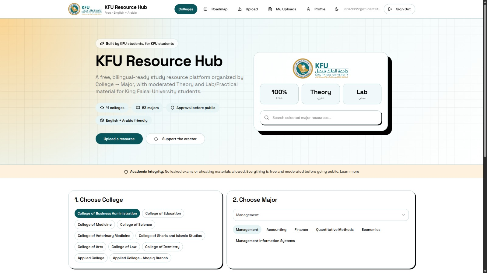
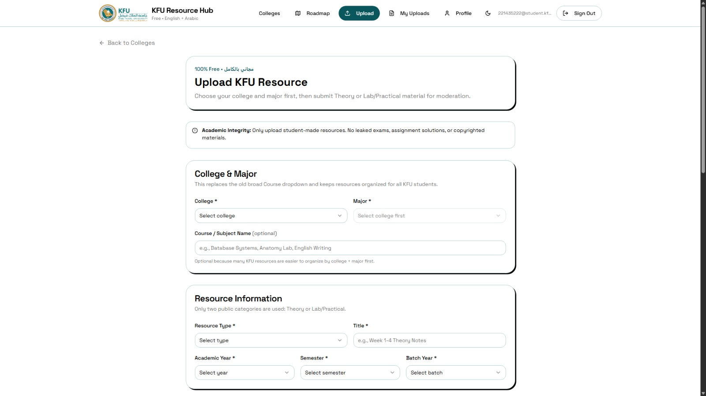
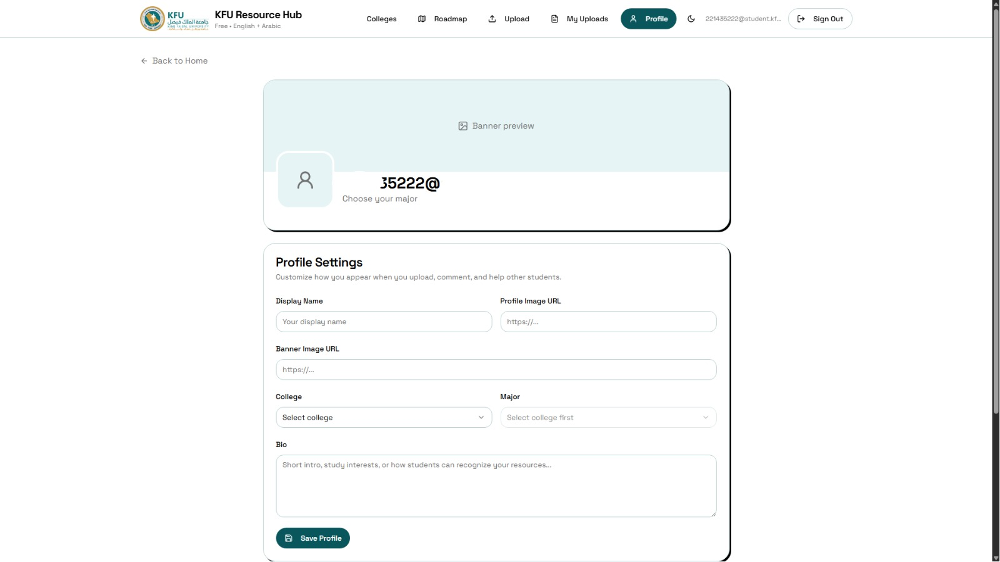

# Marja' | مرجع

<div align="center">

**مرجع: بنك مصادر لطلاب KFU**  
**Marja': KFU Resource Hub**

A free-of-charge, community-driven student resource platform for King Faisal University students.  
منصة مجانية يقودها المجتمع الطلابي لتنظيم ومشاركة مصادر طلاب جامعة الملك فيصل.

[](#tech-stack)
[](#tech-stack)
[](#tech-stack)
[](#deployment)

</div>

---

## Table of Contents

- [English](#english)
- [العربية](#العربية)
- [Screenshots](#screenshots)
- [Tech Stack](#tech-stack)
- [Project Structure](#project-structure)
- [Local Development](#local-development)
- [Environment Variables](#environment-variables)
- [Deployment](#deployment)
- [Security Notes](#security-notes)
- [Creator Support](#creator-support)

---

# English

## Overview

**Marja' | مرجع** is a free-of-charge, community-driven student resource platform created for King Faisal University students. The platform helps students organize, discover, and share academic resources by **College → Major**, making it easier to find useful study material without relying on scattered links or unstructured group chats.

The project is designed to support moderated academic sharing. Uploaded resources can be organized by section, file type, academic year, semester, batch year, lecturer, topic, and tags. The goal is to help students find relevant material while keeping the platform clean, respectful, and academically safe.

## Key Features

- **College → Major organization** for KFU students.
- **KFU-wide structure**, not limited to one department.
- **CCSIT support**, including:
  - Computer Science
  - Information Systems
  - Computer Engineering
  - Computer Network Systems
- **Resource section classification**:
  - Theory
  - Lab / Practical
- **File type labels**:
  - Student Explanation
  - Student Notes
  - Summary
  - Doctor Revision
  - Past Exams Compilation
  - Recorded Lecture
  - Slides
  - Etc / Other
- **Authentication with Supabase**.
- **KFU email-focused access flow**.
- **Moderation workflow** before resources appear publicly.
- **Profile page** with display name, profile image URL, banner URL, college, major, and bio.
- **Resource detail pages** with descriptions and sharing support.
- **Upvotes, praise, and comments** for community engagement.
- **Arabic and English ready UI direction**.
- **Free platform messaging** with creator support via Ko-fi.

## Supported Colleges and Majors

The platform includes a KFU college and major hierarchy, including business, education, medicine, science, veterinary medicine, sharia and Islamic studies, arts, law, dentistry, applied colleges, and CCSIT.

---

# العربية

## نبذة عن المشروع

**مرجع | Marja'** هو بنك مصادر مجاني لطلاب جامعة الملك فيصل، مبني كمشروع مجتمعي يساعد الطلاب على مشاركة وتنظيم الملفات والمصادر الدراسية بطريقة واضحة ومنظمة.

بدل أن تكون المصادر مبعثرة في روابط أو مجموعات، يعتمد مرجع على تنظيم المحتوى حسب **الكلية → التخصص**، مع تصنيف الموارد حسب القسم الدراسي ونوع الملف ومعلومات إضافية مثل السنة الدراسية، الفصل، الدفعة، الدكتور، الموضوع، والوسوم.

هدف المشروع هو تسهيل الوصول للمصادر المفيدة بين الطلاب، مع الحفاظ على بيئة مشاركة منظمة وآمنة أكاديميًا من خلال نظام مراجعة قبل نشر الملفات للعامة.

## المميزات الرئيسية

- تنظيم المصادر حسب **الكلية ثم التخصص**.
- دعم عدة كليات في جامعة الملك فيصل وليس تخصصًا واحدًا فقط.
- دعم كلية علوم الحاسب وتقنية المعلومات **CCSIT** وتشمل:
  - علوم الحاسب
  - نظم المعلومات
  - هندسة الحاسب
  - أنظمة شبكات الحاسب
- تصنيف القسم الدراسي إلى:
  - نظري
  - عملي / لاب
- تصنيف نوع الملف إلى:
  - شرح طالب
  - ملاحظات طالب
  - ملخص
  - مراجعة دكتور
  - تجميع اختبارات سابقة
  - محاضرة مسجلة
  - شرائح عرض
  - أخرى
- تسجيل دخول ومصادقة باستخدام Supabase.
- تجربة موجهة لبريد جامعة الملك فيصل.
- نظام موافقة ومراجعة قبل ظهور الموارد للعامة.
- صفحة ملف شخصي تحتوي على الاسم الظاهر، صورة الحساب، صورة الغلاف، الكلية، التخصص، ونبذة مختصرة.
- صفحات تفاصيل للموارد مع إمكانية المشاركة.
- نظام تفاعل مجتمعي عبر التعليقات، التصويت، والثناء.
- واجهة جاهزة للتوسع بين العربية والإنجليزية.
- توضيح أن المنصة مجانية بالكامل مع زر لدعم المطور عبر Ko-fi.

---

# Screenshots

> Note: If the screenshots still show older text such as “KFU Resource Hub,” update the screenshots after applying the latest Marja branding changes.

## Home Page



## College and Major Selection


## Upload Resource Page



## Resource Details / Browse View


## Profile Page



---

# Tech Stack

## Frontend

- **React** — component-based UI.
- **TypeScript** — safer development and better maintainability.
- **Vite** — fast development server and production bundling.
- **Tailwind CSS** — utility-first styling.
- **shadcn/ui + Radix UI** — accessible UI components.
- **Lucide React** — icon system.
- **React Router** — client-side routing.
- **TanStack Query** — async data fetching and caching.

## Backend and Services

- **Supabase Auth** — user authentication.
- **Supabase PostgreSQL** — database for courses, resources, profiles, reports, comments, reactions, and moderation.
- **Supabase Row Level Security** — authorization and table-level protection.
- **Supabase Storage** — intended for file storage and resource uploads.
- **Netlify** — free static hosting and continuous deployment from GitHub.

## Development Tools

- **npm** — package management.
- **Git + GitHub** — version control and repository hosting.
- **Netlify redirects** — single-page app routing support.

---

# Project Structure

```txt
cs-hub-connect-main/
├── public/
│   ├── marja-icon.png
│   ├── favicon.ico
│   └── robots.txt
├── src/
│   ├── assets/
│   ├── components/
│   ├── contexts/
│   ├── data/
│   ├── hooks/
│   ├── integrations/
│   │   └── supabase/
│   ├── lib/
│   ├── pages/
│   └── main.tsx
├── supabase/
│   └── migrations/
├── docs/
│   └── screenshots/
├── index.html
├── netlify.toml
├── package.json
├── tailwind.config.ts
└── vite.config.ts
```

---

# Local Development

## 1. Install dependencies

```bash
npm install
```

## 2. Create local environment file

Create a file named `.env` in the root folder:

```env
VITE_SUPABASE_PROJECT_ID=your_project_ref
VITE_SUPABASE_URL=https://your_project_ref.supabase.co
VITE_SUPABASE_PUBLISHABLE_KEY=your_supabase_publishable_key
VITE_SUPABASE_ANON_KEY=your_supabase_anon_key
```

## 3. Run development server

```bash
npm run dev
```

## 4. Build for production

```bash
npm run build
```

---

# Environment Variables

| Variable | Purpose |
|---|---|
| `VITE_SUPABASE_PROJECT_ID` | Supabase project reference ID |
| `VITE_SUPABASE_URL` | Supabase project URL |
| `VITE_SUPABASE_PUBLISHABLE_KEY` | Frontend-safe Supabase publishable key |
| `VITE_SUPABASE_ANON_KEY` | Frontend-safe Supabase anon key, if used by the project |

Never commit `.env` to GitHub.

---

# Deployment

## Netlify Settings

Use these settings when deploying from GitHub:

```txt
Build command: npm run build
Publish directory: dist
```

For single-page app routing, keep this in `netlify.toml`:

```toml
[[redirects]]
  from = "/*"
  to = "/index.html"
  status = 200
```

## Supabase Setup

The project requires Supabase tables and policies. Apply migrations from:

```txt
supabase/migrations/
```

If the Supabase CLI cannot connect because of network or port issues, copy migration SQL files manually into:

```txt
Supabase Dashboard → SQL Editor
```

Then run the files from oldest to newest.

---

# Security Notes

- Do not upload `.env` to GitHub.
- Do not expose the Supabase `service_role` key in the frontend.
- Use Row Level Security policies for all protected tables.
- Keep uploads moderated before public display.
- Restrict sensitive actions, such as approval, to admin users only.
- Keep academic integrity rules visible to users.

---

# Creator Support

Marja' is intended to stay free for students. If users want to support the creator, they can use:

[Support the creator on Ko-fi](https://ko-fi.com/kiwii9)

---

# License / Usage

This project is currently a personal showcase and student-focused platform. Add a formal license before accepting external contributions or production community use.

