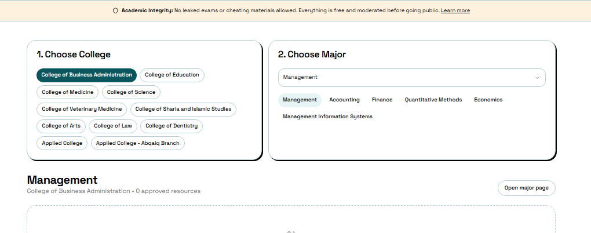
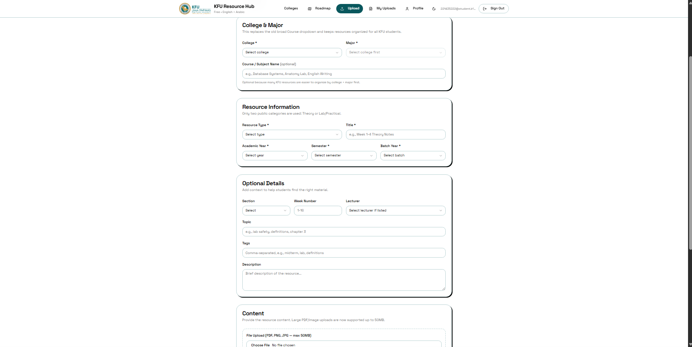

# KFU Study Hub


# مرجع | Marja'

**مرجع: بنك مصادر لطلاب KFU**  
**Marja': KFU Resource Hub**

A free-of-charge, community-driven student resource platform for King Faisal University students. Marja' helps students find, organize, share, and review academic resources by **College → Major**, with structured **Theory** and **Lab / Practical** sections, file-type labels, moderation, and bilingual Arabic/English support.

منصة مجانية ومجتمعية لطلاب جامعة الملك فيصل تساعد الطلاب على مشاركة وتنظيم المصادر الدراسية حسب **الكلية → التخصص**، مع تقسيم واضح بين **النظري** و **العملي / اللاب**، وتصنيف نوع الملف، ومراجعة المحتوى قبل ظهوره، ودعم العربية والإنجليزية.

---

## 🌐 Live Demo | رابط الموقع

> Replace this link if you change the Netlify domain.

**Website:** https://kfu-resource-hub.netlify.app/

---

## 📸 Screenshots | لقطات من المشروع

> Add your screenshots to `docs/screenshots/` using the file names below.  
> ضع صور المشروع داخل مجلد `docs/screenshots/` بنفس الأسماء التالية.

| Home / الرئيسية | Upload Resource / رفع مصدر |
|---|---|
|  |  |

| College & Major Browsing / تصفح الكليات والتخصصات | Resource Details / تفاصيل المصدر |
|---|---|
|  |  |

| Profile / الملف الشخصي | Admin Moderation / لوحة المراجعة |
|---|---|
|  |  |

### Suggested screenshot commands | طريقة تجهيز مجلد الصور

```bash
mkdir -p docs/screenshots
```

Recommended screenshot names:

```txt
home.png
upload.png
college-major.png
resource-details.png
profile.png
admin.png
```

---

# 🇬🇧 English

## About the Project

**Marja' | مرجع** is a student-first academic resource hub built for King Faisal University. The platform is designed to make useful study materials easier to find, safer to share, and better organized across different colleges and majors.

Instead of mixing everything in one general course list, Marja' follows a clear academic structure:

```txt
College → Major → Resource Section → File Type
```

The project is intended to be free for students, community-driven, and moderated to protect academic integrity.

---

## Main Features

- **Bilingual interface:** Arabic and English language support.
- **KFU-focused structure:** Organized by King Faisal University colleges and majors.
- **CCSIT support:** Includes Computer Science, Information Systems, Computer Engineering, and Computer Network Systems.
- **Theory / Lab organization:** Resources can be separated by section type.
- **Detailed file labels:** Student Explanation, Student Notes, Summary, Doctor Revision, Past Exams Compilation, Recorded Lecture, Slides, and Etc / Other.
- **Global search:** A clean search experience instead of confusing tab-based navigation.
- **Authentication:** Supabase Auth with KFU email-domain validation.
- **Moderated uploads:** Uploaded resources can be reviewed before becoming public.
- **Resource sharing:** Public resource links can be copied and shared.
- **Profiles:** Students can customize their display name, avatar, banner, major, and bio.
- **Community engagement:** Comments, upvotes, and praise for helpful contributors.
- **Creator support:** Ko-fi support link for voluntary support.
- **Responsive UI:** Works across desktop and mobile screens.

---

## Tech Stack

### Frontend

- **React 18**
- **TypeScript**
- **Vite**
- **React Router**
- **Tailwind CSS**
- **shadcn/ui**
- **Radix UI**
- **Lucide React icons**
- **React Hook Form**
- **Zod validation**
- **TanStack React Query**
- **Sonner toasts**

### Backend & Database

- **Supabase Auth** for authentication
- **Supabase Postgres** for database tables
- **Supabase Storage** for uploaded resources
- **Row Level Security policies** for authorization
- **SQL migrations** for schema changes

### Hosting & Deployment

- **Netlify** for frontend hosting
- **GitHub** for source control
- **Netlify SPA redirects** for React Router routes

---

## Database Concept

Core tables may include:

```txt
profiles
courses
resources
lecturers
reports
comments
resource_reactions
user_roles
```

The resource system supports:

```txt
college
major
section: Theory / Lab-Practical
file_type
status: pending / approved / rejected
uploader profile
comments
upvotes / praise
```

---

## Supported Colleges & Majors

The platform is designed to support all King Faisal University majors, including:

- College of Computer Sciences & Information Technology (CCSIT)
  - Computer Science
  - Information Systems
  - Computer Engineering
  - Computer Network Systems
- College of Business Administration
- College of Education
- College of Medicine
- College of Science
- College of Veterinary Medicine
- College of Sharia and Islamic Studies
- College of Arts
- College of Law
- College of Dentistry
- Applied College
- Applied College - Abqaiq Branch

---

## Resource Types

Marja' separates **section** from **file type**.

### Section

```txt
Theory
Lab / Practical
```

### File Type

```txt
Student Explanation
Student Notes
Summary
Doctor Revision
Past Exams Compilation
Recorded Lecture
Slides
Etc / Other
```

---

## Local Development

### 1. Clone the repository

```bash
git clone https://github.com/Kiwii9/cs-hub-connect.git
cd cs-hub-connect
```

### 2. Install dependencies

```bash
npm install
```

### 3. Create environment variables

Create a `.env` file:

```env
VITE_SUPABASE_PROJECT_ID=your_project_ref
VITE_SUPABASE_URL=https://your_project_ref.supabase.co
VITE_SUPABASE_PUBLISHABLE_KEY=your_supabase_publishable_key
VITE_SUPABASE_ANON_KEY=your_supabase_anon_key
```

Never commit `.env` to GitHub.

### 4. Run locally

```bash
npm run dev
```

### 5. Build for production

```bash
npm run build
```

---

## Deployment Notes

### Netlify settings

```txt
Build command: npm run build
Publish directory: dist
```

If the project uses Bun on Netlify and the build succeeds, that is also acceptable. For consistency, `npm run build` is recommended.

### Netlify redirect rule

For React Router routes to work on refresh/direct links, add this to `netlify.toml`:

```toml
[[redirects]]
  from = "/*"
  to = "/index.html"
  status = 200
```

### Supabase Auth URLs

Set these in Supabase Authentication URL Configuration:

```txt
Site URL:
https://kfu-resource-hub.netlify.app

Redirect URLs:
https://kfu-resource-hub.netlify.app/**
http://localhost:5173/**
```

---

## Security Notes

- Do not upload `.env`.
- Do not expose the Supabase `service_role` key.
- The Supabase publishable/anon key can be used in frontend apps, but database access must be protected using RLS.
- User uploads should remain moderated before becoming public.
- KFU email validation should be enforced on the backend, not only in the frontend.

---

## Creator Support

If Marja' helped you or your community, you can support the creator here:

**Ko-fi:** https://ko-fi.com/kiwii9

---

# 🇸🇦 العربية

## نبذة عن المشروع

**مرجع | Marja'** هو بنك مصادر دراسية موجّه لطلاب جامعة الملك فيصل. يهدف المشروع إلى تسهيل الوصول إلى المصادر المفيدة، وتنظيمها بطريقة واضحة، ومساعدة الطلاب على مشاركة الشروحات والملاحظات والملخصات والملفات الدراسية بشكل آمن ومنظم.

بدل أن تكون المصادر موزعة بشكل عشوائي، يعتمد مرجع على هيكلة واضحة:

```txt
الكلية → التخصص → القسم → نوع الملف
```

المشروع مجاني للطلاب، قائم على مساهمة المجتمع، ويعتمد على المراجعة قبل نشر المحتوى للمحافظة على النزاهة الأكاديمية.

---

## المميزات الرئيسية

- **دعم العربية والإنجليزية:** واجهة قابلة للتبديل بين اللغتين.
- **تنظيم حسب كليات جامعة الملك فيصل:** اختيار الكلية ثم التخصص.
- **دعم تخصصات CCSIT:** علوم الحاسب، نظم المعلومات، هندسة الحاسب، وأنظمة شبكات الحاسب.
- **تقسيم نظري وعملي:** فصل المصادر حسب القسم: نظري أو لاب/عملي.
- **تصنيف نوع الملف:** شرح طالب، ملاحظات طالب، ملخص، مراجعة دكتور، تجميع اختبارات سابقة، محاضرة مسجلة، سلايدات، أو غير ذلك.
- **بحث موحد:** شريط بحث واضح بدل التنقل المعتمد على تبويبات مربكة.
- **تسجيل دخول:** باستخدام Supabase Auth مع التحقق من نطاق بريد جامعة الملك فيصل.
- **مراجعة المصادر:** رفع الملفات يكون قابلًا للمراجعة قبل ظهوره للعامة.
- **مشاركة المصادر:** إمكانية نسخ رابط مباشر للمصدر.
- **ملفات شخصية:** يمكن للطالب إضافة اسم عرض، صورة، بنر، تخصص، ونبذة قصيرة.
- **تفاعل مجتمعي:** تعليقات، تصويت إيجابي، وتقدير للمساهمات المفيدة.
- **دعم المطوّر:** رابط Ko-fi للدعم الاختياري.
- **واجهة متجاوبة:** مناسبة للكمبيوتر والجوال.

---

## التقنيات المستخدمة

### الواجهة الأمامية

- **React 18**
- **TypeScript**
- **Vite**
- **React Router**
- **Tailwind CSS**
- **shadcn/ui**
- **Radix UI**
- **Lucide React icons**
- **React Hook Form**
- **Zod validation**
- **TanStack React Query**
- **Sonner toasts**

### الخلفية وقاعدة البيانات

- **Supabase Auth** للمصادقة وتسجيل الدخول
- **Supabase Postgres** لقاعدة البيانات
- **Supabase Storage** لتخزين الملفات المرفوعة
- **Row Level Security** للتحكم بالصلاحيات
- **SQL migrations** لإدارة تحديثات قاعدة البيانات

### النشر وإدارة المشروع

- **Netlify** لاستضافة الواجهة
- **GitHub** لإدارة الكود
- **Netlify SPA redirects** لدعم روابط React Router

---

## فكرة قاعدة البيانات

الجداول الأساسية قد تشمل:

```txt
profiles
courses
resources
lecturers
reports
comments
resource_reactions
user_roles
```

يدعم نظام المصادر:

```txt
الكلية
التخصص
القسم: نظري / لاب أو عملي
نوع الملف
حالة المصدر: بانتظار المراجعة / مقبول / مرفوض
صاحب الرفع
التعليقات
التصويت / الثناء
```

---

## الكليات والتخصصات المدعومة

المنصة مصممة لدعم تخصصات جامعة الملك فيصل، ومنها:

- كلية علوم الحاسب وتقنية المعلومات
  - علوم الحاسب
  - نظم المعلومات
  - هندسة الحاسب
  - أنظمة شبكات الحاسب
- كلية إدارة الأعمال
- كلية التربية
- كلية الطب
- كلية العلوم
- كلية الطب البيطري
- كلية الشريعة والدراسات الإسلامية
- كلية الآداب
- كلية الحقوق
- كلية طب الأسنان
- الكلية التطبيقية
- الكلية التطبيقية - فرع بقيق

---

## أنواع تنظيم المصادر

في مرجع، **القسم** منفصل عن **نوع الملف**.

### القسم

```txt
نظري
لاب / عملي
```

### نوع الملف

```txt
شرح طالب
ملاحظات طالب
ملخص
مراجعة دكتور
تجميع اختبارات سابقة
محاضرة مسجلة
سلايدات
أخرى
```

---

## التشغيل المحلي

### 1. نسخ المشروع

```bash
git clone https://github.com/Kiwii9/cs-hub-connect.git
cd cs-hub-connect
```

### 2. تثبيت الحزم

```bash
npm install
```

### 3. إنشاء ملف متغيرات البيئة

أنشئ ملف `.env`:

```env
VITE_SUPABASE_PROJECT_ID=your_project_ref
VITE_SUPABASE_URL=https://your_project_ref.supabase.co
VITE_SUPABASE_PUBLISHABLE_KEY=your_supabase_publishable_key
VITE_SUPABASE_ANON_KEY=your_supabase_anon_key
```

لا ترفع ملف `.env` إلى GitHub.

### 4. تشغيل المشروع محليًا

```bash
npm run dev
```

### 5. بناء نسخة الإنتاج

```bash
npm run build
```

---

## ملاحظات النشر

### إعدادات Netlify

```txt
Build command: npm run build
Publish directory: dist
```

### إعداد تحويلات Netlify

حتى تعمل روابط React Router عند التحديث أو فتح رابط مباشر، أضف التالي إلى ملف `netlify.toml`:

```toml
[[redirects]]
  from = "/*"
  to = "/index.html"
  status = 200
```

### روابط Supabase Auth

ضع التالي في إعدادات Supabase Authentication URL Configuration:

```txt
Site URL:
https://kfu-resource-hub.netlify.app

Redirect URLs:
https://kfu-resource-hub.netlify.app/**
http://localhost:5173/**
```

---

## ملاحظات الأمان

- لا ترفع ملف `.env`.
- لا تشارك مفتاح Supabase من نوع `service_role`.
- مفتاح Supabase publishable/anon يمكن استخدامه في الواجهة، لكن يجب حماية قاعدة البيانات باستخدام RLS.
- يجب مراجعة الملفات المرفوعة قبل نشرها للعامة.
- التحقق من بريد جامعة الملك فيصل يجب أن يكون في الخلفية وليس في الواجهة فقط.

---

## دعم المطوّر

إذا أعجبك المشروع أو استفدت منه، يمكنك دعم المطوّر اختياريًا عبر:

**Ko-fi:** https://ko-fi.com/kiwii9

---

## License | الرخصة

This project is currently maintained as a student/community project. Add your preferred license before accepting external contributions.

هذا المشروع حاليًا مشروع طلابي/مجتمعي. أضف الرخصة المناسبة قبل استقبال مساهمات خارجية.


</details>
